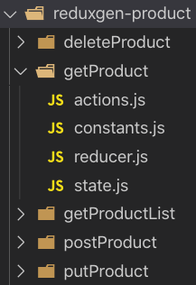

# Redux scaffolding code generator

## Prepare

- Nodejs
- Yarn

## Init

```bash
$ git clone git@github.com:cuppar/reduxgen.git
$ cd reduxgen
$ yarn && yarn link
$ chmod +x src/index.js
```

## Usage

```bash
$ cd /where/you/want/to/gen
$ reduxgen product
```

It will generate some files as below.


Remind: The generated files and codes are only template files and cannot be run directly. You still need to manually modify some content, such as api path, import path, mock response data, etc.

#### reduxgen-product/getProductList/actions.js
```js
export {
  getProductList,
  dismissGetProductListResponse,
  dismissGetProductListError,
} from './reducer';
```

#### reduxgen-product/getProductList/constants.js
```js
export const GET_PRODUCT_LIST_BEGIN = 'GET_PRODUCT_LIST_BEGIN';
export const GET_PRODUCT_LIST_SUCCESS = 'GET_PRODUCT_LIST_SUCCESS';
export const GET_PRODUCT_LIST_FAILED = 'GET_PRODUCT_LIST_FAILED';
export const GET_PRODUCT_LIST_DISMISS_RESPONSE = 'GET_PRODUCT_LIST_DISMISS_RESPONSE';
export const GET_PRODUCT_LIST_DISMISS_ERROR = 'GET_PRODUCT_LIST_DISMISS_ERROR';
```

#### reduxgen-product/getProductList/state.js
```js
const initialState = {
  productList: null,
  getProductListPending: false,
  getProductListResponse: null,
  getProductListError: null,
};

export default initialState;
```

#### reduxgen-product/getProductList/reducer.js
```js
import _ from 'lodash';
import {
  GET_PRODUCT_LIST_BEGIN,
  GET_PRODUCT_LIST_SUCCESS,
  GET_PRODUCT_LIST_FAILED,
  GET_PRODUCT_LIST_DISMISS_RESPONSE,
  GET_PRODUCT_LIST_DISMISS_ERROR,
} from './constants';
import axiosPlaceholder from 'axiosPlaceholder';
import { mockRequest, enableMockApi } from 'utilsPlaceholder';
import mockGetProductList from 'mockGetProductList';

export const getProductList = (
  args = {
    
  },
) => dispatch => {
  dispatch({
    type: GET_PRODUCT_LIST_BEGIN,
  });

  return new Promise((resolve, reject) => {
    let doRequest = axiosPlaceholder.get(`apiPathPlaceholder`);

    // test
    if (enableMockApi) {
      doRequest = mockRequest(200, mockGetProductList, 100);
    }
    // end test

    doRequest.then(
      res => {
        dispatch({
          type: GET_PRODUCT_LIST_SUCCESS,
          response: res,
        });
        resolve(res);
      },
      err => {
        dispatch({
          type: GET_PRODUCT_LIST_FAILED,
          error: err,
        });
        reject(err);
      },
    );
  });
};

export const dismissGetProductListResponse = () => dispatch =>
  dispatch({
    type: GET_PRODUCT_LIST_DISMISS_RESPONSE,
  });

export const dismissGetProductListError = () => dispatch =>
  dispatch({
    type: GET_PRODUCT_LIST_DISMISS_ERROR,
  });

export const reducer = (state, action) => {
  switch (action.type) {
    case GET_PRODUCT_LIST_BEGIN:
      return {
        ...state,
        productList: null,
        getProductListPending: true,
        getProductListResponse: null,
        getProductListError: null,
      };
    case GET_PRODUCT_LIST_SUCCESS:
      return {
        ...state,
        productList: _.get(action, `response.data`, null),
        getProductListPending: false,
        getProductListResponse: action.response,
        getProductListError: null,
      };
    case GET_PRODUCT_LIST_FAILED:
      return {
        ...state,
        productList: null,
        getProductListPending: false,
        getProductListResponse: null,
        getProductListError: action.error,
      };
    case GET_PRODUCT_LIST_DISMISS_RESPONSE:
      return {
        ...state,
        getProductListResponse: null,
      };
    case GET_PRODUCT_LIST_DISMISS_ERROR:
      return {
        ...state,
        getProductListError: null,
      };
    default:
      return state;
  }
};
```